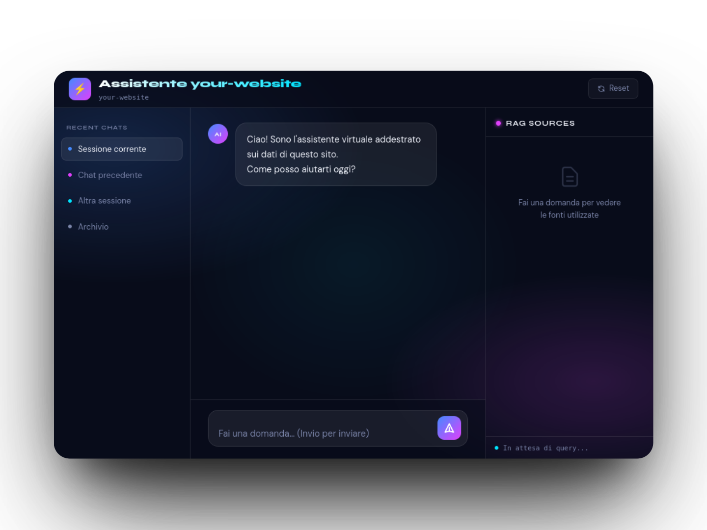

# Documentazione Approfondita: RAG Pipeline

## 1. Panoramica Generale

**rag_pipeline** è una pipeline modulare e containerizzabile progettata per trasformare automaticamente il contenuto di un intero sito web in un chatbot interattivo basato sull'architettura **Retrieval-Augmented Generation (RAG)**.

L'obiettivo principale è fornire un flusso di lavoro completo e riproducibile che, partendo da un URL (sitemap o homepage), esegua le seguenti operazioni fondamentali:
1.  **Scraping e Crawling** dell'intero sito per estrarne il contenuto testuale.
2.  **Pulizia, Normalizzazione e Chunking** intelligente del testo, ottimizzandolo per la ricerca semantica.
3.  **Generazione di Embedding** e archiviazione in un database vettoriale.
4.  **Avvio di un Chatbot RAG** che risponde alle domande degli utenti basandosi esclusivamente sulle informazioni indicizzate.

La pipeline è pensata per essere eseguita interamente in locale, sfruttando modelli LLM (Large Language Model) e di embedding eseguiti tramite **LM Studio**, garantendo la privacy dei dati e l'indipendenza da servizi cloud esterni. La struttura modulare e la configurazione centralizzata la rendono facilmente estendibile e adattabile a diverse esigenze.

---

## 2. Architettura e Flusso di Lavoro

La pipeline è organizzata in quattro step sequenziali e indipendenti. Ogni step legge i dati prodotti dal precedente e scrive i propri output in una directory dedicata, rendendo l'intero processo riprendibile e facilmente debugghabile.

**Directory dei Dati:**
- `data/raw/<site_name>/`: Contiene i file Markdown grezzi di ogni pagina web, con un header YAML.
- `data/processed/<site_name>/chunks/`: Contiene i file Markdown dei singoli chunk, arricchiti con metadati e pronti per l'embedding.
- `data/processed/<site_name>/manifest.json`: Un indice di tutti i chunk con i relativi metadati (URL, titolo, lingua, tipo, etc.).
- `data/vectorstore/<site_name>/`: Directory del database vettoriale ChromaDB per il sito.

---

## 3. Configurazione Centralizzata (`config.py`)

Tutte le costanti e i parametri della pipeline sono gestiti centralmente in `config.py`. Questo approccio semplifica la personalizzazione e garantisce la coerenza tra i vari moduli. I valori possono essere sovrascritti tramite variabili d'ambiente o un file `.env`.

---

## 4. Moduli e Step Dettagliati

### 4.1. Step 1: Crawl & Scraping

**Responsabilità:** Scaricare l'intero contenuto testuale di un sito web in formato Markdown.

- **`steps/step1_crawl/` (codice non mostrato nel contesto, ma descritto nel README):**
    - **`discovery.py`:** Gestisce la scoperta degli URL. Tenta prima di parsare la **sitemap XML**. Se fallisce o è incompleta, avvia una scansione **BFS (Breadth-First Search)** a partire dalla homepage, rispettando i limiti di profondità (`BFS_MAX_DEPTH`) e numero di pagine (`BFS_MAX_PAGES`). Gli URL vengono canonizzati per rimuovere frammenti e parametri di tracking ed evitare duplicati.
    - **`crawler.py` (Orchestratore):** Utilizza **Crawl4AI** (basato su Playwright) per eseguire il rendering delle pagine in un browser headless. Prima dello scraping, inietta script JavaScript (`js_scripts.py`) per:
        - Simulare lo scroll per caricare contenuti lazy.
        - Espandere sezioni collassate (accordion, tabs).
        - Rimuovere elementi di disturbo (navbar, footer, cookie banner).
    - **`downloader.py`:** Identifica i link a file allegati (PDF, DOCX, etc.) e li scarica in modo asincrono e parallelo.
    - **`storage.py`:** Salva ogni pagina come file `.md` in `data/raw/<site_name>/`, aggiungendo un header YAML con l'URL sorgente e un hash del contenuto. Persiste anche lo stato del BFS per permettere il ripristino in caso di interruzioni.

### 4.2. Step 2: Extraction & Cleaning (`steps/step2_extract.py`)

---
### Cambiamenti sul database condiviso tra step 2 e step 3:

**New file: pipeline_registry.py**  
Core SQLite registry shared between Step 2 and Step 3. Uses WAL mode (no persistent locks after a crash, concurrent reads safe). Two tables:
- `files` — tracks extraction status (`extract_status`) and embedding status (`embed_status`) per source file per site
- `chunks` — replaces `manifest.json`; each chunk has an `embedded` flag (0/1) enabling per-chunk incremental checkpointing

**config.py**  
- Added `PIPELINE_DB_FILENAME = "pipeline.db"` (configurable via env)  
- Added `EMBED_OVERWRITE` flag (force re-embedding all chunks)  
- Kept `PROCESSING_REGISTRY_FILENAME` and `MANIFEST_FILENAME` as deprecated legacy constants

**steps/step2_extract/processing_registry.py**  
Replaced with a 10-line shim that re-exports `PipelineRegistry` as `ProcessingRegistry`. All existing import paths continue to work.

**steps/step2_extract/metadata_enricher.py**  
Now accepts `registry: PipelineRegistry` in constructor. Calls `registry.save_chunks_batch()` instead of writing `manifest.json`. The `.md` chunk files on disk are preserved as before.

**steps/step2_extract/extractor.py**  
- `ProcessingRegistry(output_dir)` → `ProcessingRegistry(site_name, output_dir)`  
- `MetadataEnricher(output_dir)` → `MetadataEnricher(output_dir, registry)` (shared registry instance)

**steps/step3_embed/embedder.py**  
Complete rewrite using `PipelineRegistry`:
- Reads only `get_chunks_to_embed()` (delta, not full manifest) → incremental embedding
- Calls `mark_chunks_embedded(batch_ids)` after each successful batch → crash-safe checkpoint
- Accepts `overwrite` param → calls `reset_embed_status()` to force re-embedding
- Logs `already embedded / pending` counts at startup

**main.py**  
Unified overwrite flags: `--overwrite` now forces both Step 2 re-processing and Step 3 re-embedding.
`--embed-overwrite` remains as a deprecated alias and is passed through the same `overwrite` argument.

**Per-site isolation**: each site's `pipeline.db` lives in `data/processed/<site>/pipeline.db`. Two `PipelineRegistry` instances for different sites use the same schema but all queries are filtered by `site` column — data never mixes.
---

**Responsabilità:** Trasformare i file Markdown grezzi in chunk semantici puliti e arricchiti di metadati. **Questo è il cuore intelligente della pipeline.**

- **`ExtractionStep` (Classe Principale):** Orchestratore che coordina i sei sub-step per ogni file.

- **2.1 Normalizzatore (`normalizer.py` - implementato in `SmartChunker` e funzioni di utilità):** Pulisce il testo in modo deterministico: normalizzazione Unicode (NFC), rimozione di caratteri di controllo, conversione di virgolette e trattini tipografici, riduzione di spazi e righe vuote multiple.

- **2.2 Deduplicatore (`deduplicator.py` - logica non visibile ma menzionata):** Prima di inviare il testo all'LLM, verifica se il documento è già stato processato in questa esecuzione usando due metodi:
    - **Hash SHA-256:** Per duplicati esatti (stessa pagina da URL diversi).
    - **MinHash/LSH:** Per near-duplicate (pagine con contenuto molto simile ma non identico).

- **2.3 Pulizia LLM (`llm_extractor.py` - implementato via `extractor_agent`):** È l'unico punto in cui viene utilizzato l'LLM.
    - Il testo normalizzato viene inviato al modello locale (Qwen2.5-0.8B) con un **system prompt** molto specifico che gli ordina di rimuovere rumore residuo (menu, footer, banner), mantenere il contenuto informativo e ristrutturarlo con intestazioni Markdown.
    - Per documenti lunghi, viene utilizzato un **chunking intelligente (`SmartChunker`)** che divide il testo in parti, mantenendo la coerenza tramite un **riassunto rolling (`SUMMARY_FOR_NEXT`)** passato da un chunk all'altro. Questo garantisce che l'LLM abbia il contesto necessario anche quando processa parti successive di un lungo documento.
    - **Importante:** L'LLM **non** estrae metadati. Questo viene fatto in modo deterministico nello step successivo.

- **2.4 Filtro Lingua (`language_filter.py` - logica non visibile ma menzionata):** Utilizza `langdetect` per identificare la lingua del documento. I documenti in lingue inattese (configurabili) vengono scartati.

- **2.5 Chunking Semantico (`semantic_chunker.py` - implementato in `SmartChunker` e `process_file`):**
    - Il testo pulito dall'LLM viene suddiviso in chunk rispettando la struttura logica del documento (intestazioni Markdown `H1`, `H2`, `H3`).
    - Se una sezione è troppo lunga, viene ulteriormente suddivisa per paragrafi.
    - Se il documento è privo di struttura (es. un lungo testo senza heading), si attiva un fallback basato sul conteggio token con overlap.
    - Il risultato è una serie di chunk semanticamente autonomi.

- **2.6 Arricchimento Metadati e Salvataggio (`metadata_enricher.py` - implementato in `_combine_chunk_results` e `process_file`):**
    - I metadati del documento padre (URL, titolo, lingua, tipo) vengono estratti deterministicamente dal testo pulito tramite regex (es. il primo H1 come titolo).
    - Questi metadati vengono **iniettati come prefisso** in ogni chunk (`enriched_text`). Questo permette al vettore del chunk di catturare anche il contesto globale del documento.
    - Ogni chunk viene salvato come file `.md` individuale.
    - Viene generato un `manifest.json` globale, che funge da indice ricco e filtrabile per tutti i chunk del sito.

### 4.3. Step 3: Embedding & Vector Store (`steps/step3_embed/`)

**Responsabilità:** Creare una rappresentazione vettoriale dei chunk e archiviarli in un database per il retrieval.

- **`embedder.py` (non mostrato nel contesto, ma descritto):**
    - Legge il `manifest.json` e i file dei chunk dalla directory `processed`.
    - Per ogni chunk, genera un **embedding** vettoriale chiamando il modello di embedding (es. Qwen3-Embedding-0.6B) esposto da LM Studio, tramite un client compatibile con l'API di OpenAI.
    - Inserisce i vettori e i metadati associati in una **collection ChromaDB** dedicata al sito, salvata in `data/vectorstore/<site_name>/`.

### 4.4. Step 4: Retrieval & Chatbot RAG (`steps/step4_retrieve/`)

**Responsabilità:** Implementare il chatbot interattivo che risponde alle domande degli utenti basandosi sui dati indicizzati.

- **`retriever.py` - Classe `Retriever`:**
    - Gestisce la connessione a ChromaDB e la generazione di embedding per le query.
    - Il metodo `retrieve(query, ...)`:
        1.  Genera l'embedding della query usando lo stesso modello di embedding dello Step 3.
        2.  Esegue una similarità coseno su ChromaDB per trovare i chunk più rilevanti.
        3.  Supporta filtri opzionali sui metadati (`where` clause).
        4.  Applica una soglia di similarità (`score_threshold`) per filtrare i risultati meno pertinenti.
        5.  Restituisce una lista di oggetti `RetrievedChunk` contenenti testo, punteggio e metadati.

- **`chatbot.py` - Classe `RAGChatbot`:**
    - **`__init__`:** Inizializza un `Retriever` e un client `AsyncOpenAI` per comunicare con l'LLM di LM Studio. Mantiene una cronologia (`self._history`) della conversazione.
    - **`answer(user_query)`:** È il cuore del ciclo RAG per una singola domanda.
        1.  **Recupera:** Chiama il `retriever` per ottenere i chunk rilevanti.
        2.  **Stampa:** Mostra all'utente le sorgenti (`_print_sources`) da cui attingerà la risposta.
        3.  **Costruisce il Contesto:** Assembla i chunk recuperati in un unico blocco di testo (`_build_context`).
        4.  **Costruisce i Messaggi:** Crea la lista di messaggi per l'LLM (`_build_messages`) includendo: system prompt, cronologia recente, il contesto appena creato e la domanda dell'utente.
        5.  **Genera:** Invia i messaggi all'LLM (Qwen2.5-0.8B) con i parametri di temperatura e max tokens definiti in `config.py`.
        6.  **Aggiorna:** Aggiunge la domanda e la risposta alla cronologia, troncandola se necessario per non superare la finestra di contesto.
    - **`run_chat_loop` (Funzione):** Avvia un loop interattivo sulla riga di comando, gestendo l'input dell'utente, i comandi (es. `quit`, `reset`) e chiamando il metodo `answer()` del chatbot.

---

## 5. Modelli e Ottimizzazioni

La pipeline è stata ottimizzata per funzionare efficacemente con modelli di dimensioni contenute (~0.5-0.8 miliardi di parametri) eseguiti localmente.

| Modello | Utilizzo | Dettagli |
|---|---|---|
| **Qwen2.5-0.8B** | Generazione del testo (Step 2, Step 4) | Usato per pulire i documenti (Step 2) e per rispondere all'utente (Step 4). La finestra di contesto pratica è di ~8000 token. |
| **Qwen3-Embedding-0.6B** | Embedding (Step 3, Step 4) | Modello specializzato per creare rappresentazioni vettoriali del testo. Genera vettori di dimensione 1024. |

Le principali ottimizzazioni nei parametri (riflesse in `config.py`) sono state:

- **`MAX_INPUT_TOKENS` (6000):** Ridotto per lasciare spazio a system prompt, cronologia e risposta dell'LLM.
- **`CHUNK_SIZE_TOKENS` (2048):** I chunk devono essere abbastanza piccoli da permettere di includerne più di uno nel contesto finale dell'LLM.
- **`RAG_TOP_K` (8) e `RAG_MAX_CTX_CHUNKS` (4):** Recupera 8 chunk, ma ne passa solo i 4 migliori al contesto, dopo aver applicato una soglia di similarità (`RAG_SCORE_THRESHOLD = 0.25`).
- **`RAG_TEMPERATURE` (0.6):** Un valore intermedio per bilanciare creatività e aderenza ai fatti.
- **`RAG_MAX_HISTORY_TURNS` (3):** Mantiene una cronologia di 3 turni (6 messaggi) per preservare la coerenza della conversazione senza saturare il contesto.

---