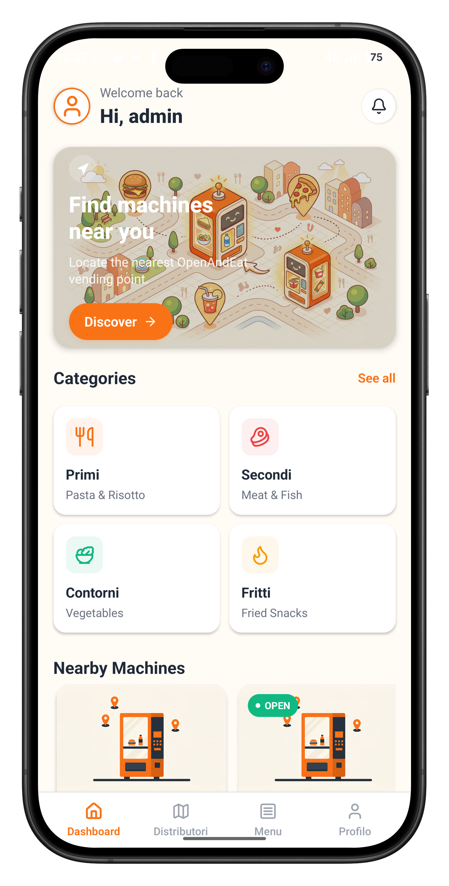
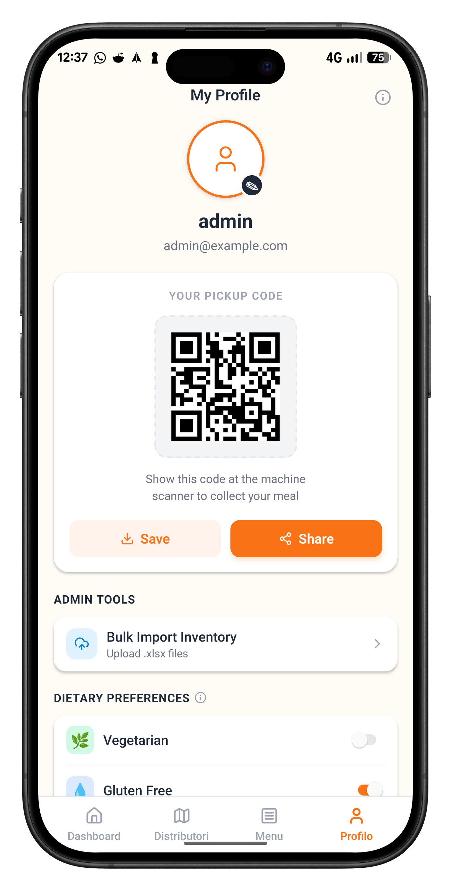
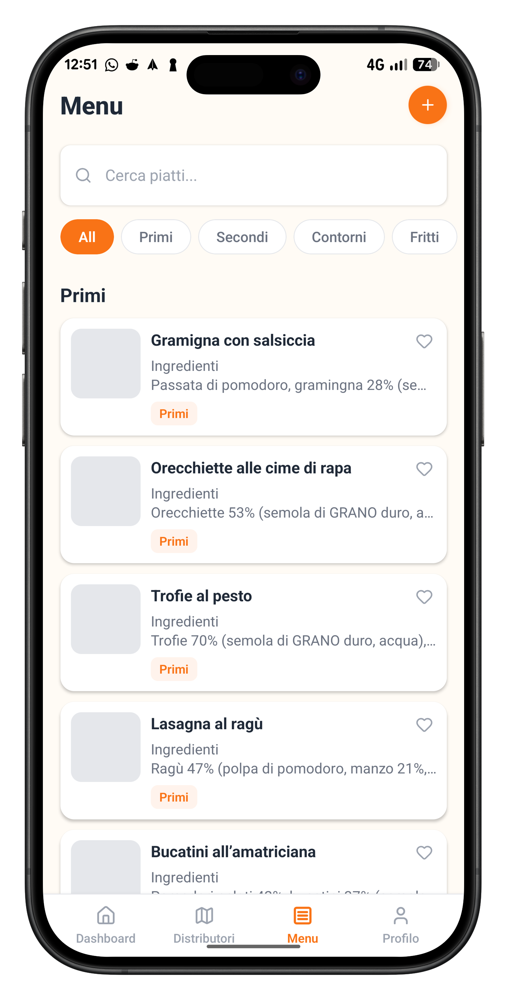
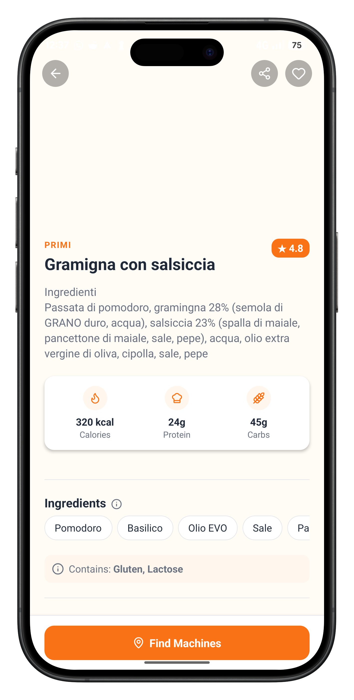
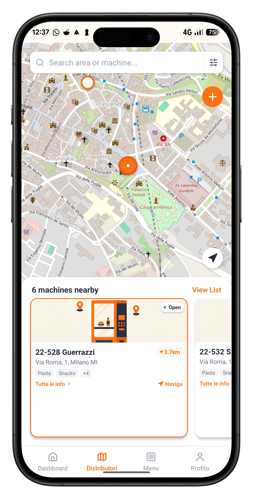
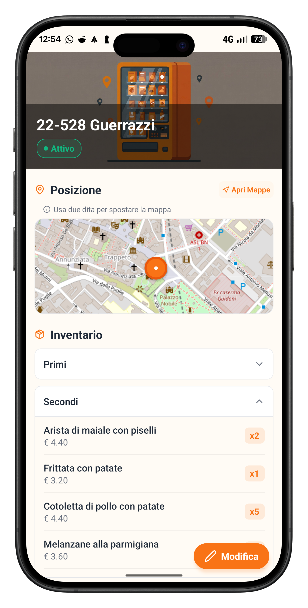

# OpenAndEat: La Rivoluzione del Pasto Veloce

**Il tuo pasto gourmet, sempre a portata di mano.** OpenAndEat non è solo un’app, ma un ecosistema completo che connette i consumatori a una rete di distributori intelligenti, offrendo piatti di qualità pronti in pochi minuti.

---

## 📱 L'Esperienza Utente (User Flow)

### 1. La Tua Dashboard Personale
Il punto di partenza per ogni pausa pranzo. Una Home Screen pulita e intuitiva che permette di scegliere subito se esplorare il menu o trovare il distributore più vicino.

### 2. Identità Digitale e QR Code
Ogni utente ha un profilo unico. La funzione **QR Code** integrata permette un'identificazione istantanea presso le vending machine fisiche, rendendo il ritiro del pasto rapido e senza intoppi.

### 3. Esplora il Menu
Naviga tra le macro-categorie: **Primi, Secondi, Contorni e Fritti**. Ogni sezione è pensata per guidarti verso la scelta perfetta in base alla tua voglia del momento.

### 4. Dettaglio Piatto e Trasparenza
Crediamo nella trasparenza alimentare. Per ogni piatto, l'utente può consultare:
* **Ingredienti:** Lista completa per una scelta consapevole.
* **Istruzioni di Cottura:** Step-by-step per rigenerare il prodotto.
* **Tempi di Preparazione:** Indicatori rapidi per Microonde, Forno e Padella.

### 5. Trova il Tuo Pasto sulla Mappa
Grazie alla localizzazione avanzata, puoi visualizzare tutti i distributori OpenAndEat intorno a te. Controlla lo stato della macchina (Attiva/Inattiva) e ricevi indicazioni stradali in un clic.

---

## ⚙️ Potere di Gestione (Admin Panel)

OpenAndEat offre agli amministratori strumenti potenti per gestire l'intera flotta di distributori e il catalogo prodotti in tempo reale.

### 6. Gestione Dinamica del Catalogo
Aggiungere o modificare un piatto è semplicissimo. Gli admin possono caricare nuove foto, aggiornare gli ingredienti e modificare i tempi di cottura istantaneamente per tutta la rete.

### 7. Controllo Totale sui Distributori
L'amministratore può configurare una nuova vending machine posizionandola direttamente sulla mappa e definendo l'inventario iniziale con un sistema di gestione delle quantità intuitivo.

### 8. Monitoraggio e Rifornimento Stock
Dalla vista di dettaglio del distributore, l'admin può monitorare lo stato operativo e aggiornare le scorte (rifornimento stock) con semplici controlli `+` e `-`, assicurando che i piatti preferiti dagli utenti non manchino mai.

---

**OpenAndEat** trasforma la distribuzione automatica in un'esperienza gastronomica moderna, efficiente e trasparente.