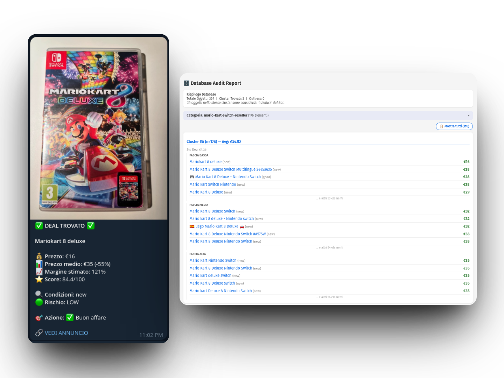

# 🤖 FollyVintedBot



> **Il tuo scout personale su Vinted. Trova i migliori affari prima di chiunque altro — automaticamente, 24/7, direttamente su Telegram.**

---

## Il problema che risolve

Su Vinted, i veri affari durano minuti. Un iPhone ricondizionato a metà prezzo, una console rara in perfette condizioni, una giacca firmata svenduta — vengono acquistati nell'arco di pochi minuti dalla pubblicazione. Se non sei davanti allo schermo in quel preciso momento, l'affare è già di qualcun altro.

FollyVintedBot monitora Vinted in modo continuo, analizza ogni nuovo annuncio con intelligenza artificiale e ti avvisa su Telegram **solo quando trova qualcosa che vale davvero**, con tutte le informazioni necessarie per decidere in secondi.

---

## ⚡ Velocità: il vantaggio competitivo principale

Il bot controlla i nuovi annunci **ogni 4-5 minuti** tramite chiamate dirette all'API di Vinted — nessun browser da avviare, nessuna pagina da caricare. Quando un nuovo annuncio viene pubblicato, il bot lo analizza e ti notifica **in meno di 5 minuti dalla pubblicazione**.

Per ogni annuncio nuovo, il ciclo di analisi completo richiede pochi secondi:

- Recupero dati dall'API → ~1s
- Analisi AI del prodotto → ~2-3s
- Notifica Telegram → istantanea

In un mercato dove la concorrenza controlla Vinted manualmente ogni ora, questo è un vantaggio enorme.

---

## 🧠 Intelligenza artificiale integrata

FollyVintedBot non si limita a raccogliere annunci: li **capisce**.

### Analisi del valore di mercato
Per ogni annuncio, il bot confronta il prezzo con uno storico di annunci simili presenti nel suo database vettoriale. La stima tiene conto di:
- Modello esatto del prodotto (es. iPhone 13 Pro ≠ iPhone 13)
- Condizioni dichiarate dal venditore
- Varianti tecniche rilevanti (storage, RAM, chip, colore)

### DNA del prodotto
L'AI estrae automaticamente le caratteristiche che impattano il prezzo — modello, variante, difetti, capacità — e le usa per trovare confronti precisi nel database. Un MacBook Pro M3 Max non viene mai confrontato con un MacBook Air M1.

### Filtro anti-spam
Il bot riconosce ed esclude automaticamente scatole vuote, accessori, videogiochi e altri articoli mal categorizzati che inquinerebbero le stime di prezzo.

### Verifica visiva
Prima di segnalare un deal, l'AI analizza l'immagine dell'annuncio per verificare che il prodotto fotografato corrisponda effettivamente a quanto dichiarato nel titolo.

### Score affare
Ogni annuncio riceve uno **score da 0 a 100** basato su:
- Margine rispetto al prezzo di mercato stimato
- Livello di confidenza della stima
- Condizioni del prodotto
- Segnali di rischio (truffa, descrizione vuota, prezzo anomalo)

---

## 📊 Stima margine reale

A differenza di altri strumenti, FollyVintedBot calcola il **costo reale di acquisto** includendo la service fee di Vinted (~7%), non solo il prezzo dell'annuncio. Il margine che vedi nella notifica è quello che effettivamente pagheresti.

---

## 🔔 Notifiche su misura

Hai il pieno controllo su quando e cosa ricevere:

**Modalità notifiche:**
- `Solo deals` — ricevi un messaggio solo quando il bot trova un affare concreto. Zero rumore.
- `Ogni ricerca` — ricevi un aggiornamento ad ogni ciclo con il numero di nuovi annunci scansionati. Ideale per monitorare il volume di traffico su una categoria.

**Messaggi riassuntivi giornalieri:**
Configura uno o più orari fissi (es. 08:00 e 21:00) per ricevere un riepilogo della giornata: quante ricerche eseguite, quanti nuovi annunci scansionati, quanti deal trovati. Perfetto per avere una panoramica senza essere sommerso di notifiche.

**Scansione automatica:**
Attiva o disattiva la scansione automatica con un tap. Anche con la scansione disattivata, puoi sempre avviarne una manuale dal bot.

**Intervallo di scansione personalizzabile:**
Scegli ogni quanto il bot controlla Vinted — da preset rapidi (5 min, 10 min, 30 min) a valori personalizzati. Il bot usa intervalli leggermente casuali per un comportamento più naturale.

---

## 🎯 Ricerche completamente personalizzabili

Ogni ricerca è configurabile nei minimi dettagli:

- **URL Vinted personalizzato** con tutti i filtri che vuoi: categoria, fascia di prezzo, condizioni, brand
- **Keywords obbligatorie** — l'annuncio viene analizzato solo se contiene le parole chiave specificate
- **Margine minimo per categoria** — puoi impostare soglie diverse per iPhone (20%) e scarpe da ginnastica (40%)
- **Generazione automatica con AI** — descrivi il prodotto in linguaggio naturale e il bot genera la configurazione ottimale

Puoi gestire tutte le ricerche direttamente da Telegram: aggiungere, modificare, eliminare senza toccare nessun file di configurazione.

---

## 💬 Interfaccia Telegram completamente interattiva

Ogni impostazione si gestisce tramite **menu con bottoni inline** — niente comandi testuali da ricordare, niente errori di battitura.

### Comandi disponibili

| Comando | Funzione |
|---|---|
| `/start` | Mostra tutti i comandi disponibili |
| `/status` | Info sistema + shortcut rapidi per tutte le impostazioni |
| `/notify` | Modalità notifiche (menu interattivo) |
| `/autoscan` | Attiva/disattiva scansione automatica (menu ON/OFF) |
| `/interval` | Intervallo di scansione (preset + personalizzato) |
| `/summary` | Gestisci messaggi riassuntivi giornalieri |
| `/list` | Lista ricerche attive |
| `/add` | Aggiungi ricerca manualmente (wizard guidato) |
| `/autoadd` | Genera ricerca automaticamente con AI |
| `/edit` | Modifica una ricerca esistente |
| `/del` | Rimuovi una ricerca |
| `/update` | Avvia una scansione manuale immediata |
| `/stop` | Interrompi scansione in corso |
| `/check` | Stima il prezzo di mercato per qualsiasi prodotto |
| `/audit` | Genera report HTML del database con clustering |
| `/purge` | Elimina un annuncio corrotto dal database |

---

## 📈 Database storico prezzi

Il bot costruisce nel tempo un database vettoriale di tutti gli annunci analizzati. Questo database è il cuore del sistema di stima: più annunci raccoglie, più le stime diventano precise.

Il comando `/check` ti permette di interrogare il database in qualsiasi momento:

```
/check Nintendo Switch OLED
→ Media stimata: €220 | Min: €180 | Max: €270
   Basato su 47 annunci simili nel database
```

Il database si autopulisce automaticamente: gli annunci più vecchi di 30 giorni vengono rimossi dal set "già visti" (così possono essere rianalizzati se ricompaiono), mentre lo storico prezzi si mantiene per le stime.

---

## 📋 Report di analisi database

Il comando `/audit` genera un **report HTML interattivo** con:
- Clustering automatico degli annunci per similarità semantica
- Fasce di prezzo per ogni cluster (bassa, media, alta)
- Identificazione degli outlier (annunci anomali che potrebbero inquinare le stime)
- Tabella completa con filtro e ordinamento
- Copia ID con un click per usare `/purge` su dati sporchi

---

## 🔒 Sicurezza

- Accesso riservato esclusivamente al tuo `TELEGRAM_CHAT_ID` — nessun altro può interagire con il bot
- Il token Telegram non appare mai nei log
- Rate limiting integrato per tutte le API esterne
- Retry automatico con backoff su errori di rete

---

## ⚙️ Stack tecnico

| Componente | Tecnologia |
|---|---|
| Scraping | API Vinted (JSON) + Selenium fallback |
| Database vettoriale | ChromaDB (similarity search) |
| Database strutturato | SQLite con WAL mode |
| Embedding | Google Gemini Embedding |
| Analisi AI | Gemma 3 27B |
| Verifica visiva | Gemma 3 27B Vision |
| Bot Telegram | python-telegram-bot v20 |
| Deploy | Docker / Raspberry Pi |

---

## 🚀 Deploy in 5 minuti

### Requisiti
- Docker + Docker Compose
- Token bot Telegram (da [@BotFather](https://t.me/BotFather))
- Google API Key (gratuita con Gemini Free Tier)

---

## 💡 Casi d'uso reali

**Reseller di elettronica** — monitora iPhone, MacBook, console gaming con soglie di margine personalizzate. Ricevi l'alert con score, margine stimato e link diretto all'annuncio mentre il venditore sta ancora aspettando la prima offerta.

**Collezionista** — tieni d'occhio categorie di nicchia (vinili, figure, orologi) con keyword specifiche. Il database costruisce nel tempo una stima precisa del valore di mercato anche per prodotti rari.

**Acquirente occasionale** — usa `/check` per capire immediatamente se il prezzo di un annuncio che hai trovato manualmente è un affare o nella media.

---

## 📦 Struttura del progetto


---

## 🗺️ Roadmap

- [ ] Filtro "prezzo calato" — notifica se un annuncio già visto abbassa il prezzo
- [ ] Modalità silenziosa per orario (es. no notifiche 23:00-08:00)
- [ ] Soglie di scoring configurabili per singola ricerca
- [ ] Grafico storico prezzi con `/trend`
- [ ] Export CSV/Excel degli annunci raccolti
- [ ] Supporto multi-piattaforma (Subito.it, eBay)

---

*FollyVintedBot è uno strumento personale per uso privato. L'utilizzo delle API di Vinted è soggetto ai termini di servizio della piattaforma.*